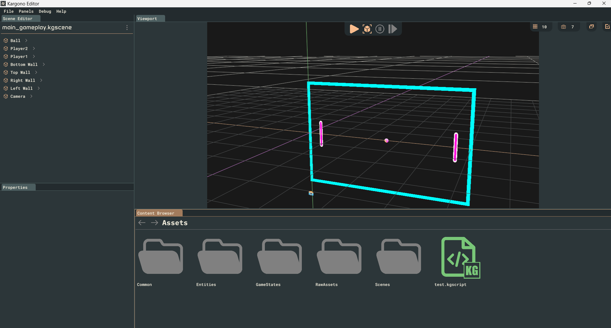
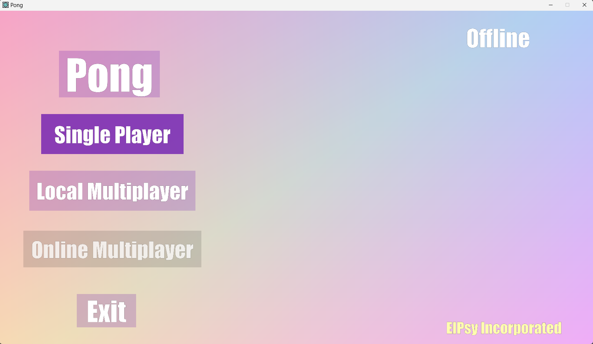
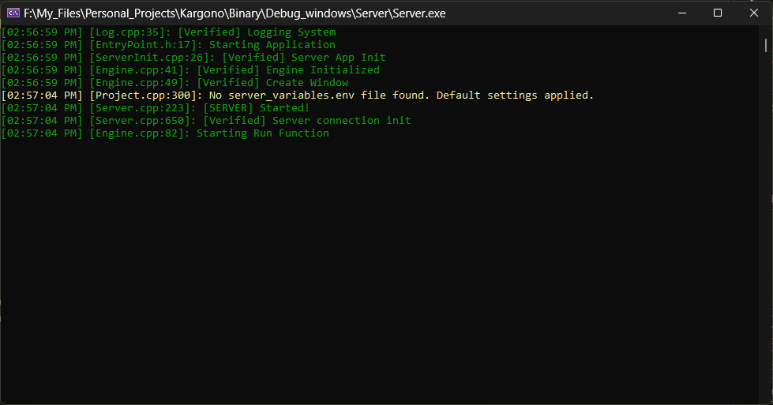
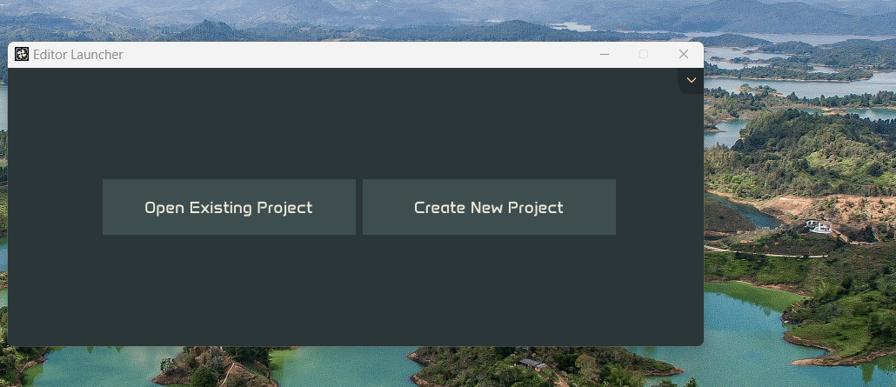
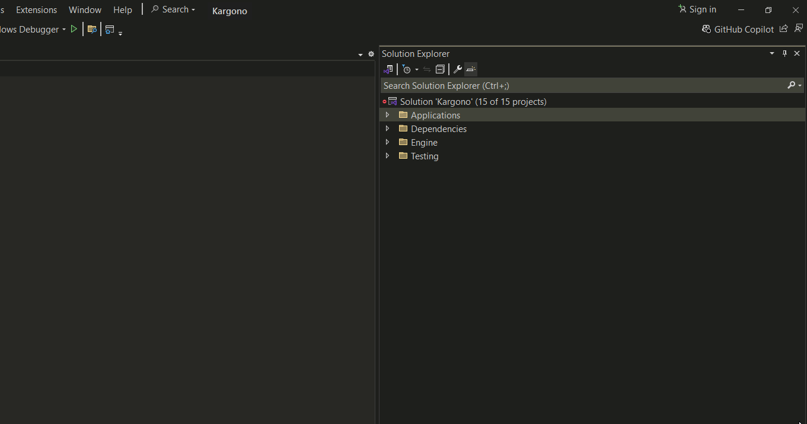

# About Project 

| Stable-Branch | Development-Branch |
| ------- | ----- |
|  |  |

This project is a simple game editor for 2D projects (3D in the future). The project includes: a game editor (Editor), an exporting project (Runtime), a multiplayer server (Server), and a core engine library (Engine). The Editor, Server, and Runtime are all stand alone executables that depend on the Engine library. 

*(View of main editor)*

*(View of pong runtime)*

*(View of server running in terminal)*

Feel free to try creating a game using the Editor or use an existing project (Currently only Pong is available). Game Projects are stored in the Projects directory. New projects can be created in the editor launcher and Pong can be downloaded from the editor launcher.

*(How to download Pong sample project)*

The Editor only supports Windows. I do not have plans for supporting Linux or Mac for the Editor. The Runtime and Server executables are intended to be multi-platform, however, it only supports Windows currently. 

The latest version of this project is always accessible in the Development-Branch (dev). The Stable-Branch (main) currently holds the latest stable version of the engine. I intend to add a versioning system soon, where the Stable-Branch will only hold major version changes.
# Quickstart
## Requirements
- Windows 64 bit is currently required for all executables.
- [Visual Studio](https://visualstudio.microsoft.com/downloads/) with C++ support for editor usage. My build is vs2022. These configurations can be added on a fresh install of VS. Adding C++ support to an existing installation requires opening the Visual Studio Installer Standalone app.
- The project uses a C++ code standard of at least C++ 20. Make sure your visual studio install supports this version of the C++ standard.
- [Git](https://git-scm.com/downloads) for Windows.
- [Vulkan](https://vulkan.lunarg.com/) SDK with Debug Binaries. Version should be 3.0 or above.
## Instructions
- Ensure the above requirements are met.
- Clone the latest version of the Stable-Branch (latest stable version):

		git clone https://github.com/ElPsyKongroo1/Kargono.git
- Clone the latest version of the Development-Branch (experimental features):

		git clone -b Development-Branch https://github.com/ElPsyKongroo1/Kargono.git
	
	*(Cloning Stable-Branch)*
- Run BuildScripts/VS_GenProjects.bat to build Visual Studio Solution/Project files.
	
	*(Building visual studio project files)*
- Open Kargono.sln in central directory.
- Inside the Applications virtual directory, set either the Editor, Runtime, or Server as the default startup project.
	
	*(Set editor application to be built)*
- Build and Run!

# [Documentation](https://elpsykongroo1.github.io/Kargono/)
This documentation for the engine is fairly minimal at this point. I intend to add better engine/editor documentation with the first release version of the editor. Feel free to take a look if you like...
# Games
## Games in Progress
- Pong Clone ([Current Repo](https://github.com/ElPsyKongroo1/Pong))
## Game Projects Ideas
- Snake Clone
- Breakout Clone
- 2D Racing Game
- Twin Stick Shooter
- Mage Game
- Dungeon Crawler

# Third-Party Dependencies
## Asio (Non-Boost Version) ([Docs](https://think-async.com/Asio/))
- Framework that allows TCP/UDP network communication within the engine. 
- A cross-platform C++ library for asynchronous network and low-level I/O programming.
## Box2D ([Docs](https://box2d.org/documentation/))
- Used as the main backend 2D physics library. 
- A lightweight 2D physics engine for games, offering fast and realistic simulations of rigid body dynamics.
## Doctest ([Docs](https://github.com/doctest/doctest))
- Used as the backend testing framework. 
- Doctest is a fast, lightweight C++ testing framework that integrates seamlessly with production code.
## Doxygen ([Docs](https://www.doxygen.nl/manual/index.html))
- Used to generate engine documentation. 
- A documentation generator for C++ and other languages, creating browsable code documentation from annotated source files.
## Doxygen Awesome ([Docs](https://jothepro.github.io/doxygen-awesome-css/))
- Used for styling Doxygen documentation. 
- A modern, responsive theme for Doxygen that enhances readability and user experience.
## Dr_wav ([Docs](https://github.com/mackron/dr_libs/tree/master))
- Used to import and export .wav files in the editor.
- Single-header library for decoding and encoding .wav audio files.
## entt ([Docs](https://github.com/skypjack/entt))
- ECS system used to manage entities inside scenes.
- A fast, lightweight C++ entity-component-system (ECS) library for game development and real-time applications.
## FileWatch ([Docs](https://github.com/ThomasMonkman/filewatch))
- FileWatcher used to automatically update files in use in the editor.
- A simple, cross-platform C++ library for monitoring file changes in real time.
## GLFW ([Docs](https://www.glfw.org/documentation.html))
- Used to interact with the underlying operating system and window context in editor and runtime.
- Cross-Platform Library for creating and managing OS windows, OpenGL contexts, and handling input.
## GLEW ([Docs](https://glew.sourceforge.net/))
- Supports the initialization of the main rendering API.
- The OpenGL Extension Wrangler Library for handling OpenGL extensions and OpenGL function pointers.
## GLM ([Docs](https://github.com/g-truc/glm))
- Used for most mathematical structures and functions in the engine.
- Mathematics library for graphics programming, providing vectors, matrices, and transformations.
## hash-library ([Docs](https://github.com/stbrumme/hash-library?tab=readme-ov-file))
- Main cryptographic library for generating SHA and CRC hashes throughout the engine.
- A header-only C++ library by stbrumme for efficient hashing algorithms like MD5, SHA-1, and SHA-256.
## ImGui ([Docs](https://github.com/ocornut/imgui))
- Backend UI rendering library for the editor application.
- Immediate Mode Graphical User Interface library for creating GUIs in C++.
## ImGuiColorTextEdit ([Docs](https://github.com/BalazsJako/ImGuiColorTextEdit))
- Used as basis for text editor in the engine's editor application.
- A colorizing text editor widget for ImGui, tailored for source code editing and highlighting.
## ImGuizmo ([Docs](https://github.com/CedricGuillemet/ImGuizmo))
- Used in editor to display and interact with gizmos.
- Tool produces a Gizmo that is usable for modifying transforms and other applications.
## MSDF-Gen ([Docs](https://github.com/Chlumsky/msdfgen))
- Generate msdf fonts for use in RuntimeUI.
- A tool for generating multi-channel signed distance fields (MSDFs) for crisp text and shape rendering.
## MSDF Atlas Gen ([Docs](https://github.com/Chlumsky/msdf-atlas-gen))
- Generate glyph atlas for MSDF fonts.
- A utility for creating MSDF texture atlases to efficiently render fonts and vector shapes.
## OpenGL ([Docs](https://www.khronos.org/opengl/))
- Current backend graphics API for rendering 2D and 3D graphics.
- A cross-platform API for rendering 2D and 3D graphics, widely used in real-time applications like games.
## OpenAL Soft ([Docs](https://github.com/kcat/openal-soft))
-  Used as back-end for outputting audio to output devices (speakers and whatnot).
- Cross-platform audio API for spatialized sound.
## Optick ([Docs](https://github.com/bombomby/optick))
- Main profiler used inside engine editor.
- A real-time C++ profiler for analyzing and optimizing application performance with minimal overhead.
Profiler used in Editor for Engine.
## Premake ([Docs](https://github.com/bombomby/optick))
- Used as main C++ building system for engine project files.
- A build configuration tool that generates project files for multiple platforms and build systems using a simple Lua script.
## stb_image ([Docs](https://github.com/nothings/stb/tree/master))
- Used to serialize and deserialize raw image data within engine.
- Single-header library for loading various image file formats.
## Vulkan SDK ([Docs](https://vulkan.lunarg.com/))
- Cross compiler is used for shader generation.
- A cross-platform toolkit providing tools, libraries, and headers for developing high-performance Vulkan-based applications.
## yaml-cpp ([Docs](https://github.com/jbeder/yaml-cpp))
- Used for all human readable serialization/deserialization in the engine.
- A C++ library for parsing and emitting YAML, offering a simple API for working with configuration files.
